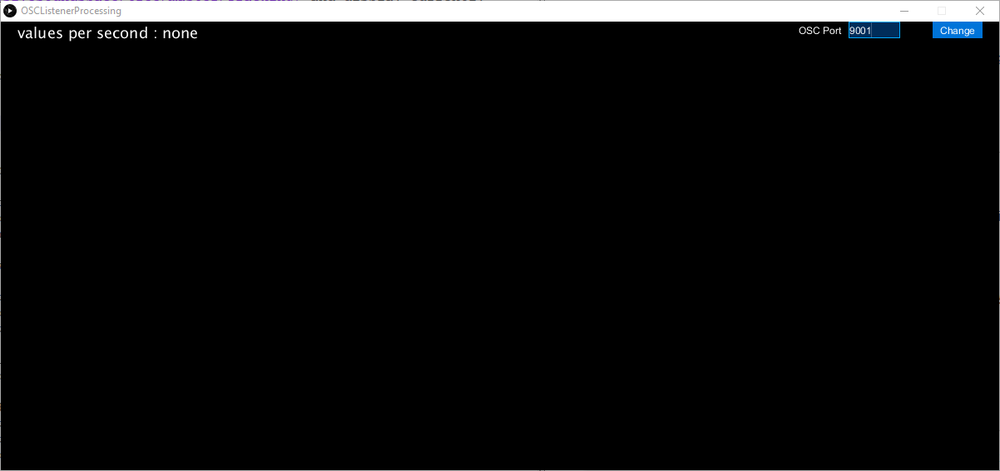
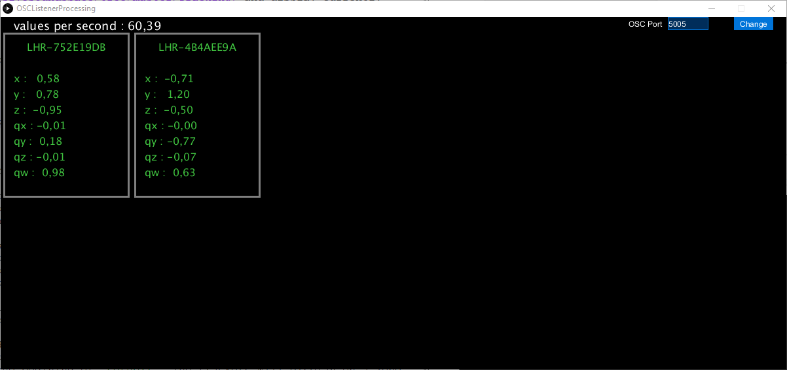

# OSC Listener Processing
A tool to check OSC messages are sent from [HTCTrackerPositionSender script](https://github.com/numediart/ImmersiveSoundSpace/tree/master/Tracking) and display currently tracked Trackers.

## Requirements
- [Processing IDE](https://processing.org/download/) (Java mode)
- [oscP5 library](https://github.com/sojamo/oscp5) installed from library manager
    - Open Processing
    - Click on Sketch -> Import Library... -> Add Library...
    - In the *Filter* field, type *oscp5*
    - Select "**oscP5 |** An Open Sound Control (OSC) implementation."
    - Click *Install* button
- [ImmersiveSoundSpace](https://github.com/numediart/ImmersiveSoundSpace) installed and **running**

## How to use
- Open *OSCListenerProcessing.pde*
- Set the OSC port to listen @ line 23 (same port as the one defined by `--listeners` argument when launching Tracking script) :  
`final int oscPort = 9001;`
- Set the timeout for deleting tracker from the hashmap @ line 25 :  
`final int TIMEOUT = 2000;`
- Click the *Run* button above the code window

## What is look like
If no trackers are found or the OSC communication is not working, the screen will look like this :  
  
Check the print log at the bottom of the Processing window to see if there is an error, and check you set listen the port the tracking script is sending to.

If trackers are found, the window will look like this (below is the output of HTCTrackerPositionSender script) :  
  
- The first line gives the number of received messages per second. In that case, the framerate of the HTCTrackerPositionSender script is set to 30 but as there are 3 trackers and a message is sent for eache tracker, it is normal to find about 90 messages per second.
- For each tracker, the serial id is displayed at the top and the coordinates (in meters, relative to the calibrated origin) are displayed below.

Due to the space available on the display, it is possible to display 12 trackers, which might be enough for most of applications but if you need to display more, resize the window with the `size(width, height)` function at the begining of `setup()`. The trackers will display on a zone which is 200 pixels wide by (half of the program window height - 20).