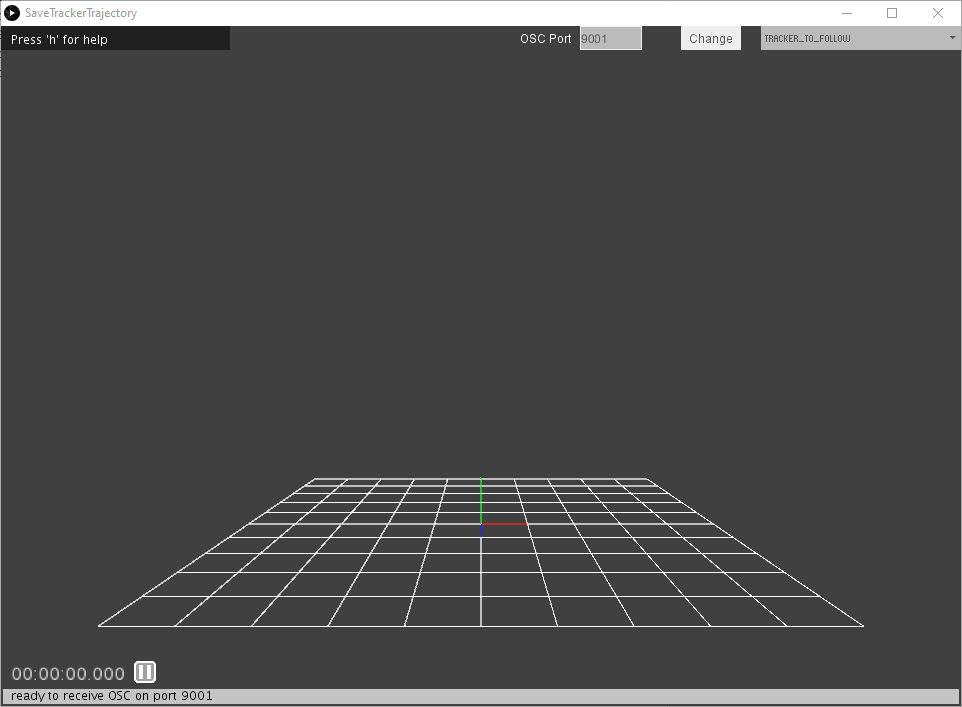
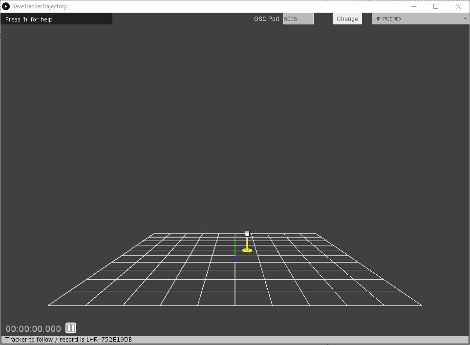
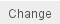
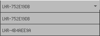

# Save Tracker Trajectory Processing
A tool to receive OSC messages sent from [HTCTrackerPositionSender script](https://github.com/numediart/ImmersiveSoundSpace/tree/master/Tracking) and save the trajectory of a given tracker as a csv file.

## What it looks like
If no trackers are found or the OSC communication is not working, the screen will look like this :  
  
Check the print log at the bottom of the Processing window to see if there is an error, and check you set listen the port the tracking script is sending to.

If trackers are found, the window will look like this :  

The tracker is represented in 3D space by a white cube. to help visualize its height, a yellow circle is drawn on the floor, at the vertical of the tracker, and this vertical is represented by a yellow line.

## How to use
- Open *SaveTrackerTrajectory.pde* or launch the *SaveTrackerTrajectory.exe* downloaded from the release page
- You might need to allow the application to access the network (firewall window)
- If you opened th code from the Processing editor, click the *Run* button above the code window
- You can change the listening OSC port by editing its value in the text field  and click on the button  at the top of the application. The entered value must be written with digits only and be between 1024 and 65532.
- You can change the recorded tracker by selecting its serial in the dropdown list in the upper right corner of the application.  

- At the bottom of the screen, the status bar displays the current status of the application. Check it if you encounter problems. The solution might be there. :wink:
- Just above this bar, on the left is the recording chrono. It will start to increment as soon as you launch the recording. Right next to it, you can see an icon : Two vertical bars when the recording is stopped or paused; A red round when the program is recording.

### Keyboard controls
The keyboard controls can be used either in uppercase or lowercase.

- **h** : display help for keyboard controls
- **n** : create or select a csv file to record data into. This command will open a file dialog box that may be hidden behind other windows. You may need to use Alt-Tab to find it. Opening a new file will reset the chrono.
- **r** : Start / pause / resume recording of the incomming data for the selected tracker. When resuming a recording, the chrono is not reset. **Before starting to record, you need to select a csv file.**
- **e** or **escape** : Exit the application.